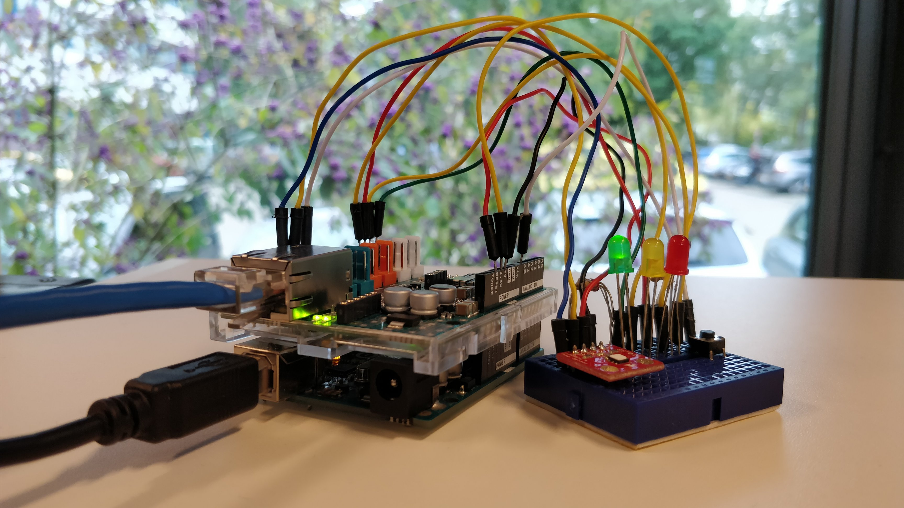
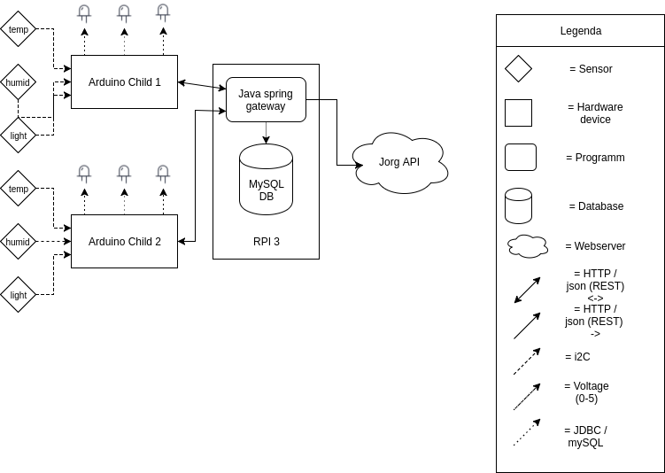

# IoT-WeatherStation
`An arduino weather station system with gateway. University of Applied Science Arnhem en Nijmegen (HAN): Internet of Things (IoT)`

 
Jump to: 
 [Child (arduino) subproject](https://github.com/SijmenHuizenga/IoT-WeatherStation/tree/child) | 
 [Gateway subproject](https://github.com/SijmenHuizenga/IoT-WeatherStation/tree/gateway)

## System Vision
This weather system measures environment weather data from multiple child weather stations into a single location named the Gateway. This gateway stores all measured data in a database and makes the data available through a http rest api and a web dashboard. The data is also forwarded to another centralized weather measuring system called the JorgApi.

The childs are built using arduino's with networking shields and temperature, humidity and light sensors. The exact data that these childs are able to record are specified in the chapter Measurements.

An overview of the system is shown in the below image:

## System flow

An installation of the weather system always exist of 1 gateway. 

After plugging in the new weather child, the weather child wil ask the user to fill in a mac address and the IP of the gateway these wil be saved in the EEPROM for next startup. After this configuration is complete the child will initialize the sensors en connect to the network using DHCP
When the arduino is connected to the network it will send its IP to the Gateway. The gateway will respond with the timestamp and the childs new ID. The ID will be saved in the EEPROM so it wil be available after a restart.
As soon as the child has received its ID it wil start sending data using that ID to the gateway. The gateway stores all the measurements from the child in a database.

If the power goes off from the child, and the child is powered on again the child will not try to register again. The child already has an ID, mac and gateway IP so it connects to the network sends its ID and IP to the gateway and starts sending data again.

Children all have a green, orange and red led. always one of these leds will be turned on depending on the temperature. When the temperature is higher than the green threshold it will be orange, and the red led will light up if the temperature is higher than the red threshold. These two thresholds can be configured using rest endpoints on the children. 

The gateway stores information about the ip's of its children. Using this information the gateway can always reach the children. This is useful for configuring the thresholds on the children. The gateway has endpoints for this configurating the children so that users can talk to the gateway without having to worry about the exact location of the children. 

### Measurements
The childs sensors measure the following data:

Humidity is measured using a [Si7021](https://www.silabs.com/documents/public/data-sheets/Si7021-A20.pdf) sensor. The data transmitted from the children to the gateway is in percentages with float percision between 0 and 80. 

Temperature is measured using the same sensor as Humidity in [degrees celsius](https://en.wikipedia.org/wiki/Celsius) with float precision between 10 and 85.

Light is measured using a light diode and is transmitted to the gateway in floats between 0 and 100 where 0 is no light and 100 is the maximum amount of light that the diode can measure.

Atmospheric Pressure is implemented in the whole code base but a sensor is not available. Therefor this data will always be empty.

## Child <-> Gateway communication
The child and gateway communicate with each other to exchange information. Both provide a rest api that is documented using Swagger. The gateway api specs of the child can be found [here](https://github.com/SijmenHuizenga/IoT-WeatherStation/blob/child/api.yaml). To view the rendered version of this specifications use the [swagger editor](editor.swagger.io). The api specs of the gateway can be viewed on the url `/swagger` and `/swagger-ui.html` on a running gateway. All request between gateway and child are explained below.

## System installation
To get the whole weather system up and running you need three things. First of all you need a DHCP server. Install instructions on how to get this working on a raspberry pi can be found [here](https://github.com/SijmenHuizenga/IoT-WeatherStation/blob/pi/readme.md). Next, the gateway should be setup. It is possible to run the gateway on the raspberry pi, but it is also possible to run the gateway on another machine. For both options there are install instructions available in the [gateway subproject](https://github.com/SijmenHuizenga/IoT-WeatherStation/tree/gateway). Finally you will need one or more child arduino's to actually measure the environment variables. How to set this up can be read in the [child subproject](https://github.com/SijmenHuizenga/IoT-WeatherStation/tree/child).

## Desisions 

### Getting arduinos on the network
For getting arduinos on the internet there are a couple of options. 
* Giving every arduino a random IP
  - Negatives
    - Possibility of arduinos having the same IP.
    - IP's will be all over the place.
  - Positives
    - Easy to implement
* Using a standard IP when booting and asking the gateway via HTTP for a new one.
  - Negatives
    - only one arduino can initialize at the same time.
    - ip addresses wil be sent over http and the arduino needs to restart its network for the IP to apply
  - Positives
    - no need for a dhcp server
* Using DHCP to supply the arduinos with IPs (we chose this one)
  - Negatives
    - There needs to be an DHCP server on the network
  - Positives
    - The Ethernet library and DHCP will make sure every arduino gets an unique IP.
    - DHCP is reliable
    
### Identifying the arduinos
There are a couple of options to identify an arduino on the network
* Using the IP addres from the arduino to identify it.
  - Negatives
    - Ip addresses can change, the data won't be linked to the right station in the database
    - The is a maximum amount of IPv4 addresses
    - Childs can not be named becouse of the changing IP addresses
  - Positives
    - easy to implement
* Using MAC address to identify an arduino
  - Negatives
    - A MAC address can be changed
    - Someone with malicious intentions can inject false data by spoofing his mac address
  - Positives
    - Every arduino already needs to have an unique MAC address
* Using a unique ID supplied by the gateway and stored in the  (We chose this one)
  - Negatives
    - The ID may get to a very big number after some time of having a lot of diffrent arduinos (and ID wil only be used once becouse of the database
  - Positives
    - ID's can be linked to a name in the gateway for easy management
    - Every arduino will have an unique ID througout its lifetime
    - You can add as many arduino as the network allows
