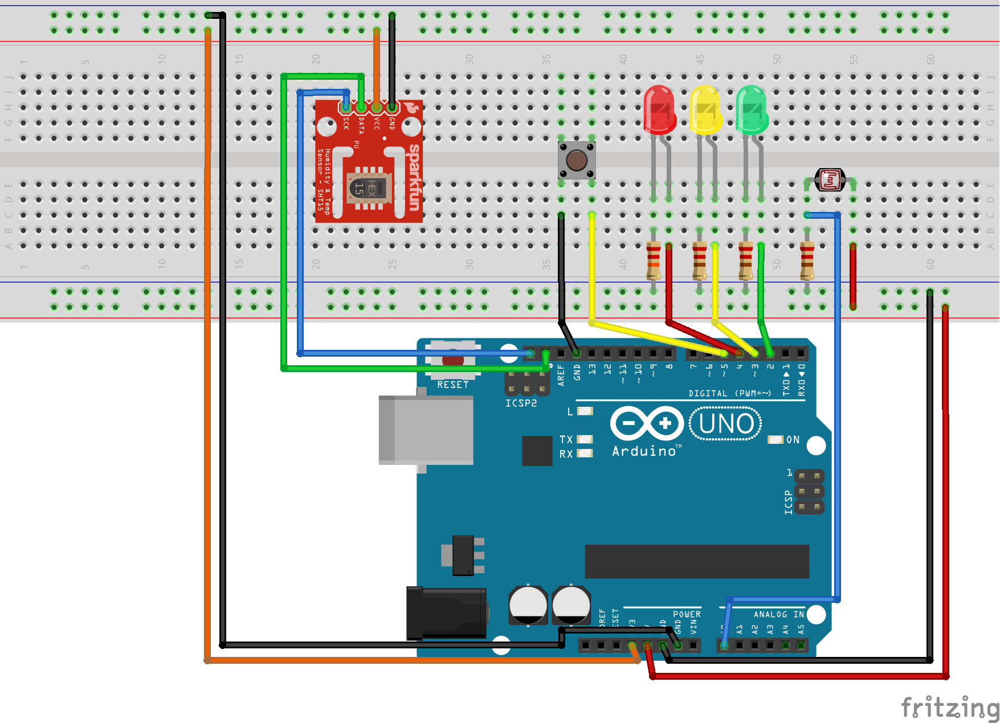

# IoT-WeatherStation
A arduino weather station with gateway. University of Applied Science Arnhem en Nijmegen (HAN): Internet of Things (IoT). This branch contains the code for child arduino's. These childs measure environmental data and sent it to the gateway.

## Functionalities
The child has many fancy functionalities. Its primary objective is to measure environmental data (temperature, humidity and brightness) and send it to the [gateway](https://github.com/SijmenHuizenga/IoT-WeatherStation/tree/gateway). 

When the child wakes up (is powered on) it requests an ip address using dhcp. That it registers and logs in as described in the [system flow](https://github.com/SijmenHuizenga/IoT-WeatherStation/tree/master#system-flow). While the child is awake it reads the temperature and updates the leds accordingly. Furthermore exposes the child a rest api that can be used to configure the temperature tresholds for the colored led. This api is described [here](https://github.com/SijmenHuizenga/IoT-WeatherStation/blob/child/api.yaml) and can be viewed using the online [swagger editor](editor.swagger.io).

The child has a single button that resets the child. With a short press only the id is reset. This is usefull for when you want to relocate the child to a different location within the same network. The child will register again at the gateway and receive a new id. All future measurements are sent using this id. A long press (more than 5 seconds) will reset the whole child and requires you to go through [setup again](#settings-setup).

## Installation
How to go from an Arduino, an ethernetshield, and a couple of sensors to a weatherboys weatherstation.

### Phisical setup
First, connect a Ethernet Shield 2 on the Arduion. Than connect the sensors using the following wireing scheme.



### Libraries
The following libraries are required to compile the program:
* **SparkFun Si7021 Breakout Library** [***Avalable here***](https://github.com/sparkfun/Si7021_Breakout). This is the library that reads the Si7021 values.
* **Ethernet2** [***Avalable here***](https://github.com/adafruit/Ethernet2) This library is needed for the ethernet shield 2. This software has only been tested on the ethernet shield 2.

If you are not familiar with installing Arduino Libraries, go [here](https://www.arduino.cc/en/Guide/Libraries) to get started.

### Code [***available here***](https://github.com/SijmenHuizenga/IoT-WeatherStation/tree/child)
There are two programs that can be used:
* **ClearArduino** This program makes sure there is no unwanted values in te EEPROM. Upload and run this program first before uplaoding the primary program.
* **Weather_Child** This is the awesome weatherstation code, it does *Everything*.

### Settings setup
To install the weatherstation code on the arduino you first need to run the ClearArduino code. This simple program clears the eeprom from old variables. After that just upload the Weather_Child code. The first time the program is executed on the arduino the serial connection is used to setup some settings. So make sure you have the arduino connected to your computer and a serial port is open. The arduino will guide you through the steps and will ask you to provide some information. This will be self-explanitory. All settings are stored in eeprom so this process should only be executed once.

When everything is configured you can disconnect the serial connection and enjoy your awesome weatherboys weatherstation!


## Program design

### Wether_child.ino
This is the main program, this is where al the timers run and the order of functions is managed.

### Button.h / cpp

This is where all the button configuration is done.

To change the button pin change line 1 in the `Button.h`.

`#define BUTTONPIN 5` change the 5 to any other unused pin.

To change the long press time change line 6 in the `Button.h`.

`  int longPress = 5000;` change 5000 to whatever value you desire. The delay is in milliseconds, so if you want 3 seconds change it to 3000.

There are 4 public functions:

`void setupButton();` <-- set the buttonpin to input with pullup.

`void readButton();` <-- when called reads the currend debounced state of the button.

`void buttonActionLong();` <-- this code gets executed when te button is pressed for longer than the longpress time. (currently resets the whole child)

`void buttonActionShort();` <-- this code runs when the button is pressed for shorter then the longpress time. (currently resets the child id)

### Debug.h / cpp

In this file all the debugging is managed. Debugging writes the output to serial.

To enable or disable debugging for a feature uncomment or comment the correstonding tag.

Example:

`//#define DEBUGNETWORK` <-- network debugging disabled.

`#define DEBUGSENSOR` <-- sensor debugging enabled.

If no debugging tag is defined serial won't start.

#### How to use debugging
There are three debugging functions:

`startDebugging();` <-- starts serial if debugging is enabled

`debug("debug message", DEBUG_TYPE);` <-- print the debug data without a new line, doesn add debugging type to output.

`debugln("debug message", DEBUG_TYPE);` <-- print the debug data with a new line, adds [DEBUG_TYPE] infront of the debug line.

Example:
```
startDebugging();
int i = 3;

debugln(i, WEBCLIENT);
```
Output: `[NET] 3`

### Add custom debugging

To add a debugging tag add the following code in `Debug.h` in the switch statement.

```
#ifdef "YOURDEBUGTAG" <-- Your debugtag without quotes
    case "DEBUGCALL":<-- Your debugcall without quotes
      if (printprefix)
        Serial.print(F("[SHORTTAG] ")); <-- Your shorttag without quotes
      Serial.print(message);
      if (printnl)
        Serial.println();
      break;
#endif
```
Add your "DEBUGCALL" to the DebugType enum.

```
typedef enum DebugType {
  SENSOR, WEBCLIENT, LED, WEBSERVER, CONF, "DEBUGCALL" <-- Your debugcall without quotes
} DebugType;
```

Now to use it define your debugtag on the top in the `Debug.h` and use `debug("your message", DEBUGCALL);`.
This will print: `[SHORTTAG] your message`.

### HttpClient.h / cpp
Sends measured data, registers the child and logs in the child.

To change the gateway port change line 14 in `HttpClient.h`

`#define SERVERPORT 80` change 80 to whichever port the gateway is running on.

`updateHttpClient()` <-- manages which data to send to the gateway or wheater to listen for an answer.

### HttpServer.h / cpp

The HttpServer allows the gateway to change the settings on the child. 

To change the port on which the server wil run change line 5 in `HttpServer.h`

`#define CHILDSERVERPORT 80` change the 80 to whichever port you want the server to run on.

The most important functions are  

`void startHttpServer();` <-- starts the http server on the seleced port.

`void updateHttpServer();` <-- manages the incoming requests

### Json.h / cpp

The code in these files is used to filter Json from the html body and returns the found values

### Led.h / cpp
Manages the 3 leds for displaying the temperature in comparisont to the threshholds.

How to use:

Define the 3 leds using the following code:
```
#define REDLED <red led pin>
#define YELLOWLED <yellow led pin>
#define GREENLED <green led pin>
```

### Network.h / cpp
Enables the arduino to send data using the ethernet shield.

how to use:

connectNetwork() <-- connects to the ethernet using DHCP so no IP is needed, it uses the MAC received in the configuration.
 
### Sensors.h / cpp
Used to setup and read values from the sensors.

how to use:

`setupSensors()` <-- setup and start all sensors
`getHumidity()` <-- returns humidity in % as a float
`getTemperature()` <-- returns temperature in C as a float
`getBrightness()` <-- returns brightness as a float

### Timer.h / cpp
this function can be used to call funtions on a set interval.

How to use:

Example:
```
TimedAction* sendWeatherDataTimer = new TimedAction(); <-- Create a timer per object.
sendWeatherDataTimer->setDelay(5000); <-- set the interval in milliseconds
sendWeatherDataTimer->setCallback(sendWeatherToGateway); <-- set a funtion to call at the interval.
```

### Configure.h / cpp

This code allows the user to upload the same code to all weatherstations and configure the needed values via the Serial monitor.
In order to know which variables to ask the user the code first checks if they are already in the EEPROM.

The most important funcitons are:

`void configureChild();` <-- checks is the child has already been configured, if not, starts the configuration via serial.

`void abortChild();` <-- sets every used eeprom address to `0` and sets pin 6 to `HIGH` so the transistor resets the arduino.

